# Centralized Google Login Design

**Spec**: `.specs/features/centralized-google-login/spec.md`
**Status**: Draft

---

## Architecture Overview

Keep the current identity/session architecture and move only tenant OAuth start/callback tenant selection into signed state. The central auth host handles `/v1/auth/google` and `/v1/auth/google/callback`; tenant hosts continue handling protected API calls such as `/v1/auth/me` and `/v1/auth/logout`.

```mermaid
flowchart LR
    A["tenant.localhost.me:5173 /club/login"] --> B["frontend getTenantLoginUrl"]
    B --> C["api.localhost.me:3001 /v1/auth/google tenant + returnTo"]
    C --> D["OAuthStateService signs tenantId tenantSlug returnTo"]
    D --> E["Google OAuth"]
    E --> F["api.localhost.test:3001 /v1/auth/google/callback"]
    F --> G["OAuthStateService validates state"]
    G --> H["AuthService upserts Google user"]
    H --> I["membership check for state tenant"]
    I --> J["SessionService creates tenant session"]
    J --> K["cookie set for root domain when production"]
    K --> L["tenant.localhost.test:5173 /club"]
```



The callback path no longer uses `CurrentContextService.getTenantOrThrow()` for tenant selection. It uses the tenant in validated state and only creates a session after active membership is confirmed.

---

## Code Reuse Analysis

### Existing Components to Leverage

| Component                                           | Location                                                      | How to Use                                                                                                                                   |
| --------------------------------------------------- | ------------------------------------------------------------- | -------------------------------------------------------------------------------------------------------------------------------------------- |
| `AuthController`                                    | `apps/api/src/modules/identity/auth/auth.controller.ts`       | Keep route shape; update tenant start/callback to accept `tenant` and `returnTo`, validate central auth host, and use state-driven callback. |
| `GoogleOAuthGuard`                                  | `apps/api/src/modules/identity/auth/google-oauth.guard.ts`    | Remove tenant context dependency; pass fixed central callback URL and signed `state` in authenticate options.                                |
| `GoogleOAuthStrategy`                               | `apps/api/src/modules/identity/auth/google-oauth.strategy.ts` | Reuse Google profile validation. No provider model changes.                                                                                  |
| `AuthService`                                       | `apps/api/src/modules/identity/auth/auth.service.ts`          | Reuse Google user upsert behavior; add a tenant-explicit callback completion path that checks membership by state tenant.                    |
| `SessionService`                                    | `apps/api/src/modules/identity/session/session.service.ts`    | Reuse tenant session creation and tenant mismatch validation.                                                                                |
| `cookies.ts`                                        | `apps/api/src/modules/identity/session/cookies.ts`            | Extend set/clear helpers with optional root-domain cookie option.                                                                            |
| `TenantResolver`                                    | `apps/api/src/modules/identity/tenancy/tenant.resolver.ts`    | Reuse parsing/config behavior and add slug lookup helper if needed.                                                                          |
| `parseTenantSlugFromHost`                           | `apps/api/src/modules/identity/tenancy/tenant-host.ts`        | Preserve behavior and ensure `auth` is reserved through config defaults/tests.                                                               |
| `SystemAuthController` and `SystemGoogleOAuthGuard` | `apps/api/src/modules/identity/system/`                       | Keep system admin flow separate and regression-tested.                                                                                       |
| `tenant-auth.ts`                                    | `apps/frontend/src/lib/api/tenant-auth.ts`                    | Keep tenant API base behavior; change login URL to central auth API base and `tenant`/`returnTo` params.                                     |

### Integration Points

| System       | Integration Method                                                                                           |
| ------------ | ------------------------------------------------------------------------------------------------------------ |
| Google OAuth | Passport receives `callbackURL` from `GOOGLE_CALLBACK_URL` and `state` from `OAuthStateService`.             |
| Config       | Add `AUTH_BASE_URL`; require central `GOOGLE_CALLBACK_URL`; default reserved subdomains include `auth`.      |
| Database     | Reuse `identity_users`, `identity_tenant_memberships`, `identity_sessions`, and `identity_tenants`.          |
| Frontend     | `VITE_AUTH_API_BASE_URL` overrides central auth base; fallback derives `auth` host from `VITE_API_BASE_URL`. |

---

## Components

### Auth Host Validation

- **Purpose**: Ensure tenant OAuth start/callback only run on the reserved central auth host.
- **Location**: `apps/api/src/modules/identity/auth/` or `apps/api/src/modules/identity/tenancy/`
- **Interfaces**:
  - `assertAuthHost(request: Request): void` - throws when host is not `auth.<ROOT_DOMAIN>` or equivalent configured auth base host.
  - `isAuthHost(host: string | undefined): boolean` - supports direct unit testing.
- **Dependencies**: `ConfigService<ConfigSchema>`, `AUTH_BASE_URL`, `ROOT_DOMAIN`.
- **Reuses**: Existing host normalization style from `tenant-host.ts`.

### OAuthStateService

- **Purpose**: Generate and validate signed, expiring state payloads for tenant Google OAuth.
- **Location**: `apps/api/src/modules/identity/auth/oauth-state.service.ts`
- **Interfaces**:
  - `createTenantState(input: { tenantId: string; tenantSlug: string; returnTo?: string }): string`
  - `validateTenantState(rawState: string | undefined): Promise<OAuthTenantStatePayload>`
  - `validateInternalReturnTo(returnTo: string | undefined): string`
- **Dependencies**: `ConfigService<ConfigSchema>`, `TenantEntity` repository, Node `crypto`.
- **Reuses**: `SESSION_SECRET` secret material and existing tenant entity.

State format should be compact and deterministic for tests:

```typescript
type OAuthTenantStatePayload = {
  tenantId: string;
  tenantSlug: string;
  returnTo: string;
  nonce: string;
  iat: number;
  exp: number;
};
```

Recommended encoding: `base64url(JSON payload).base64url(HMAC_SHA256(payloadPart))`. Validate with timing-safe comparison.

### Tenant OAuth Start

- **Purpose**: Validate query inputs, resolve active tenant by slug, create state, and trigger Google OAuth.
- **Location**: `apps/api/src/modules/identity/auth/auth.controller.ts`, `google-oauth.guard.ts`
- **Interfaces**:
  - Controller reads `tenant` and `returnTo` query params.
  - Guard `getAuthenticateOptions()` returns `{ callbackURL, state }`.
- **Dependencies**: `TenantResolver` or tenant repository, `OAuthStateService`, `ConfigService`.
- **Reuses**: Existing Passport Google strategy and route decorators.

Implementation note: the guard currently calls `CurrentContextService.getTenantOrThrow()` in `canActivate()`. That must be removed for tenant central auth because `auth.<ROOT_DOMAIN>` is reserved and should not set tenant context.

### Tenant OAuth Callback Completion

- **Purpose**: Complete login using the tenant from validated state, not request context.
- **Location**: `apps/api/src/modules/identity/auth/auth.service.ts`
- **Interfaces**:
  - `completeGoogleLoginForTenant(profile: GoogleProfile, tenant: TenantEntity, requestInfo): Promise<CreatedSession>`
- **Dependencies**: `IdentityUserEntity`, `TenantMembershipEntity`, `SessionService`.
- **Reuses**: Existing Google upsert logic and membership query.

### Cookie Domain Options

- **Purpose**: Share sessions across production subdomains and avoid invalid `.localhost` domain cookies in development.
- **Location**: `apps/api/src/modules/identity/session/cookies.ts`
- **Interfaces**:
  - `setSessionCookie(res, name, token, maxAgeSeconds, options: { secure: boolean; rootDomain: string }): void`
  - `clearSessionCookie(res, name, options: { secure: boolean; rootDomain: string }): void`
  - `getSessionCookieDomain(rootDomain: string, secure: boolean): string | undefined`
- **Dependencies**: `ROOT_DOMAIN`, production/secure flag.
- **Reuses**: Existing cookie helper defaults.

### Tenant Redirect Builder

- **Purpose**: Construct final tenant frontend redirect from validated tenant slug and return path.
- **Location**: `apps/api/src/modules/identity/auth/tenant-redirect.ts` or local helper near controller.
- **Interfaces**:
  - `buildTenantFrontendRedirectUrl(input: { tenantFrontendUrl: string; rootDomain: string; tenantSlug: string; returnTo?: string }): string`
- **Dependencies**: `TENANT_FRONTEND_URL`, `ROOT_DOMAIN`.
- **Reuses**: Existing `getTenantFrontendRedirectUrl` intent, but removes callback request host dependence.

### Frontend Tenant Auth URL Builder

- **Purpose**: Start login from central auth API while keeping protected tenant API calls on tenant host.
- **Location**: `apps/frontend/src/lib/api/tenant-auth.ts`
- **Interfaces**:
  - `getTenantLoginUrl(returnTo?: string, options?: { apiBaseUrl?: string; authApiBaseUrl?: string; frontendHostname?: string }): string`
  - `getTenantApiBaseUrl(baseUrl?, frontendHostname?)` remains tenant-host scoped.
- **Dependencies**: `VITE_AUTH_API_BASE_URL`, `VITE_API_BASE_URL`, `window.location.hostname`.
- **Reuses**: Existing safe internal redirect and tenant host detection.

---

## Data Models

No database schema change is required. The feature reuses:

- `IdentityUserEntity.googleSubject` for Google identity linkage.
- `TenantEntity.slug` and `TenantEntity.active` for tenant lookup.
- `TenantMembershipEntity` for active membership enforcement.
- `IdentitySessionEntity.tenantId` for tenant-scoped sessions.

New in-memory/signed payload:

```typescript
type OAuthTenantStatePayload = {
  tenantId: string;
  tenantSlug: string;
  returnTo: string;
  nonce: string;
  iat: number;
  exp: number;
};
```

---

## Error Handling Strategy

| Error Scenario                  | Handling                                                                             | User Impact                                                 |
| ------------------------------- | ------------------------------------------------------------------------------------ | ----------------------------------------------------------- |
| Missing `tenant` query          | Reject OAuth start with bad request or forbidden response.                           | Login does not start.                                       |
| Unknown or inactive tenant      | Reject OAuth start before Google redirect.                                           | Login does not start for invalid tenant.                    |
| Start/callback on non-auth host | Reject request.                                                                      | Prevents tenant hosts from serving central OAuth endpoints. |
| Invalid `returnTo`              | Reject or normalize to default before state generation; callback always revalidates. | External redirects are blocked.                             |
| Invalid/expired/tampered state  | Reject callback and do not create session.                                           | User must restart login.                                    |
| No active membership            | Throw existing forbidden behavior; no session.                                       | User is blocked from tenant.                                |
| Cookie domain on localhost      | Omit `Domain`.                                                                       | Local browser login continues to work.                      |

---

## Tech Decisions

| Decision                  | Choice                                                     | Rationale                                                                                 |
| ------------------------- | ---------------------------------------------------------- | ----------------------------------------------------------------------------------------- |
| State storage             | Signed stateless payload                                   | Avoids adding persistence and keeps OAuth start/callback scalable.                        |
| Signing secret            | `SESSION_SECRET`                                           | Existing required high-entropy secret; no new secret required for this step.              |
| Tenant source on callback | State `tenantId` + active tenant reload                    | Callback host is central and must not resolve a tenant by host.                           |
| Return destination        | Internal path only                                         | Prevents open redirect vulnerabilities.                                                   |
| Cookie domain             | `.${ROOT_DOMAIN}` only in production/non-localhost         | Enables cross-subdomain production login while avoiding browser issues with `.localhost`. |
| Frontend auth base        | `VITE_AUTH_API_BASE_URL` override, fallback to `auth` host | Keeps deployments configurable and local dev ergonomic.                                   |

---

## Verification Strategy

- Backend unit tests for config defaults, host parsing, state signing/validation, callback membership/session behavior, cookie options, and redirect builder.
- Frontend unit tests for central auth login URL generation and external redirect rejection.
- Regression tests for `SessionService.validateTenantSession()` tenant mismatch and `/v1/system/auth/google` behavior.
- Gate commands:
  - `pnpm --filter @pong-ping/api test`
  - `pnpm --filter @pong-ping/frontend test`
  - `pnpm --filter @pong-ping/api build`
  - `pnpm --filter @pong-ping/frontend build`
