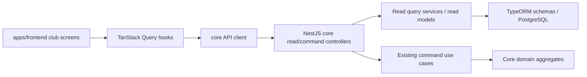

# Club Core Priority Read Integration Design

**Spec**: `.specs/features/club-core-priority-read-integration/spec.md`
**Status**: Draft

## Architecture Overview

Implement the priority scope as a vertical club-core integration: backend read controllers expose tenant-scoped DTOs, shared contracts define stable response shapes, and the Vite frontend consumes reads through TanStack Query while using existing command endpoints through mutations.

The backend read side should intentionally remain pragmatic and display-oriented. Commands keep the current rich-domain application flow; reads may use TypeORM repositories, QueryBuilder, joins, raw projections, and dedicated DTOs without reconstructing aggregates.



## Documentation Findings

Context7 was consulted on 2026-05-20 for framework/library decisions:

- TanStack Query React v5 documents object-style `useQuery({ queryKey, queryFn })`, `useMutation({ mutationFn, onSuccess })`, and `queryClient.invalidateQueries({ queryKey })` after successful mutations.
- TanStack Query docs recommend rendering query states by checking `isPending`, then `isError`, then successful `data`.
- NestJS docs confirm controllers group routes with `@Controller()`, map GET endpoints with `@Get()`, use `@Param()` and `@Query()` for request data, and inject providers through constructors.
- TypeORM docs support QueryBuilder reads with joins, filters, `orderBy`, `skip`, `take`, `getMany`, and raw aggregation via `getRawMany()`.

## Code Reuse Analysis

### Existing Components to Leverage

| Component | Location | How to Use |
| --- | --- | --- |
| API envelope helpers | `apps/api/src/common/shared/http/api-response.swagger.ts` | Reuse for read endpoint Swagger responses. |
| Tenant context | `apps/api/src/common/context` | Resolve current tenant/principal for all core reads. |
| Role guard/decorator | `apps/api/src/modules/identity/authorization/authorization.decorators.ts` | Apply member/admin access consistently with command controllers. |
| Core command controllers | `apps/api/src/modules/core/*/*-command.controller.ts` | Match route prefixes, decorators, and serializer style. |
| TypeORM schemas | `apps/api/src/modules/core/**/infrastructure/typeorm/schemas/*.schema.ts` | Query read projections directly. |
| Existing serializers | `apps/api/src/modules/core/**/presentation/http/serializers` | Reuse when a read response matches command contract shape. |
| Shared contracts | `packages/contracts/src/core.ts` | Extend with read/list/dashboard/page contracts. |
| API client | `apps/frontend/src/lib/api/client.ts` | Build `core.ts` client on top of `apiRequest`. |
| API error types | `apps/frontend/src/lib/api/errors.ts` | Preserve current error handling behavior. |
| Query client | `apps/frontend/src/lib/query-client.ts` | Reuse global TanStack Query setup. |
| Club layout/page shell | `apps/frontend/src/components/layout/club-layout.tsx`, `apps/frontend/src/components/layout/page-shell.tsx` | Keep club navigation and page structure consistent. |
| UI primitives | `apps/frontend/src/components/ui/*` | Reuse table, dialog, button, badge, skeleton, alert, select, tooltip. |

### Integration Points

| System | Integration Method |
| --- | --- |
| Backend read APIs | New read controllers under core capability modules. |
| Backend command APIs | Existing command endpoints consumed by frontend mutations. |
| Contracts package | Add response contracts for read DTOs, pagination, dashboard summary, and possibly filters. |
| Frontend query cache | Dedicated query key factories for tables, athletes, ratings, games, dashboard. |

## Backend Components

### Core Read Folder Pattern

- **Purpose**: Standardize read-side placement without polluting domain/application command layers.
- **Location**: Prefer `apps/api/src/modules/core/<capability>/presentation/http/queries` and `apps/api/src/modules/core/<capability>/presentation/http/read-models`.
- **Interfaces**:
  - Query/read-model providers may depend on TypeORM repositories or `DataSource`.
  - Controllers return response DTOs directly.
- **Dependencies**: NestJS DI, TypeORM schemas, `CurrentContextService`.
- **Reuses**: Existing capability-first module structure from `.notebook/core-module-structure.md`.

Decision: Use `presentation/http/queries` for endpoint-oriented read services and `presentation/http/read-models` for DTO/projection types. This keeps reads close to HTTP contracts and makes the intentional NestJS/ORM coupling explicit.

### Pagination Contract

- **Purpose**: Provide consistent list envelopes for tables, athletes, ratings, and games.
- **Location**: `packages/contracts/src/core.ts`, mirrored by API DTOs where needed.
- **Interfaces**:
  - `CorePageRequestContract`: `page?: number`, `pageSize?: number`.
  - `CorePageMetaContract`: `page`, `pageSize`, `totalItems`, `totalPages`.
  - `CorePageResponseContract<TItem>`: `items`, `page`.
- **Dependencies**: Existing API success envelope wraps this page response.
- **Reuses**: Existing contract package export style.

### Table Read API

- **Purpose**: List tables and return table details with queue and active game.
- **Location**:
  - `apps/api/src/modules/core/table/table-read.controller.ts`
  - `apps/api/src/modules/core/table/presentation/http/queries/table-read.query.ts`
  - `apps/api/src/modules/core/table/presentation/http/dtos/table-read.dtos.ts`
- **Interfaces**:
  - `listTables(tenantId, page): Promise<CorePageResponseContract<TableResponseContract>>`
  - `getTableDetail(tenantId, tableId): Promise<TableResponseContract>`
- **Dependencies**: `CurrentContextService`, `TableSchema`, `TableMemberSchema`, `QueueEntrySchema`.
- **Reuses**: `toTableResponse` where entity loading matches existing serializer needs.

### Athlete Read API

- **Purpose**: Return current athlete and paginated club athlete roster.
- **Location**:
  - `apps/api/src/modules/core/athlete/athlete-read.controller.ts`
  - `apps/api/src/modules/core/athlete/presentation/http/queries/athlete-read.query.ts`
  - `apps/api/src/modules/core/athlete/presentation/http/dtos/athlete-read.dtos.ts`
- **Interfaces**:
  - `getCurrentAthlete(actorId, tenantId): Promise<AthleteResponseContract>`
  - `listAthletes(tenantId, page): Promise<CorePageResponseContract<AthleteResponseContract>>`
- **Dependencies**: `CurrentContextService`, `CoreIdentityTranslator`, `AthleteSchema`.
- **Reuses**: `toAthleteResponse`.

### Rating Read API

- **Purpose**: Return ranking/ratings for the current club.
- **Location**:
  - `apps/api/src/modules/core/rating/rating-read.controller.ts`
  - `apps/api/src/modules/core/rating/presentation/http/queries/rating-read.query.ts`
  - `apps/api/src/modules/core/rating/presentation/http/dtos/rating-read.dtos.ts`
- **Interfaces**:
  - `listRatings(tenantId, page): Promise<CorePageResponseContract<RatingReadContract>>`
- **Dependencies**: `RatingSchema`, optional athlete join for display names.
- **Reuses**: Rating domain field names where they are already persisted.

### Game Read API

- **Purpose**: Return game history and game detail, including correction/original references and rating changes.
- **Location**:
  - `apps/api/src/modules/core/competition/competition-read.controller.ts`
  - `apps/api/src/modules/core/competition/presentation/http/queries/game-read.query.ts`
  - `apps/api/src/modules/core/competition/presentation/http/dtos/game-read.dtos.ts`
- **Interfaces**:
  - `listGames(tenantId, page): Promise<CorePageResponseContract<GameRecordResponseContract>>`
  - `getGame(tenantId, gameRecordId): Promise<GameRecordResponseContract>`
- **Dependencies**: `GameRecordSchema`.
- **Reuses**: `toGameRecordResponse` if entity loading is sufficient.

### Dashboard Read API

- **Purpose**: Return compact dashboard summary for `/club`.
- **Location**:
  - `apps/api/src/modules/core/core-dashboard-read.controller.ts` or `apps/api/src/modules/core/dashboard/presentation/http/...` if a dashboard capability is introduced.
  - Prefer no new domain module unless implementation needs grow beyond read orchestration.
- **Interfaces**:
  - `getDashboard(tenantId): Promise<CoreDashboardSummaryContract>`
- **Dependencies**: Table, athlete, rating, and game read query providers or TypeORM projections.
- **Reuses**: The same projections as list endpoints with smaller limits.

## Frontend Components

### Core API Client

- **Purpose**: Typed functions for core reads and existing commands.
- **Location**: `apps/frontend/src/lib/api/core.ts`
- **Interfaces**:
  - `listCoreTables(params)`
  - `getCoreTable(tableId)`
  - `getCurrentAthlete()`
  - `listCoreAthletes(params)`
  - `listCoreRatings(params)`
  - `listCoreGames(params)`
  - `getCoreGame(gameRecordId)`
  - command wrappers for table, queue, active-game, game record, correction, athlete profile.
- **Dependencies**: `apiRequest`, contracts.
- **Reuses**: `apps/frontend/src/lib/api/system-admin.ts` style.

### Core Query Keys and Hooks

- **Purpose**: Keep cache boundaries explicit and invalidation predictable.
- **Location**:
  - `apps/frontend/src/features/club/api/query-keys.ts`
  - `apps/frontend/src/features/club/api/queries.ts`
  - `apps/frontend/src/features/club/api/mutations.ts`
- **Interfaces**:
  - `coreQueryKeys.dashboard()`
  - `coreQueryKeys.tables.list(params)`
  - `coreQueryKeys.tables.detail(tableId)`
  - `coreQueryKeys.athletes.me()`
  - `coreQueryKeys.athletes.list(params)`
  - `coreQueryKeys.ratings.list(params)`
  - `coreQueryKeys.games.list(params)`
  - `coreQueryKeys.games.detail(gameRecordId)`
- **Dependencies**: `@tanstack/react-query`.
- **Reuses**: Existing `query-client.ts`.

### Club Dashboard Page

- **Purpose**: Replace static panels with API-backed operational summary.
- **Location**: `apps/frontend/src/features/club/dashboard-shell-page.tsx`
- **Interfaces**: Uses dashboard query and renders table summary, active athletes, recent games, ranking preview, and empty state.
- **Dependencies**: Core API hooks and UI primitives.
- **Reuses**: `PageShell`, existing dashboard tests.

### Club Tables Screens

- **Purpose**: Implement list/detail and command actions for table operations.
- **Location**:
  - `apps/frontend/src/features/club/tables/`
  - routes under `apps/frontend/src/routes/club/tables*.tsx`
- **Interfaces**: list tables, create/rename table, enqueue/dequeue, form active game, remove active athlete, rotate winner-stays.
- **Dependencies**: Core query hooks, mutation hooks, role/session data from club auth layout.
- **Reuses**: Existing UI table/dialog/button components.

### Club Games Screens

- **Purpose**: Record game winner, show rating changes, support correction and history.
- **Location**:
  - `apps/frontend/src/features/club/games/`
  - routes under `apps/frontend/src/routes/club/games*.tsx`
- **Interfaces**: history list, detail dialog/page, record confirmation, correction action for admins.
- **Dependencies**: Core game/table/rating query hooks.
- **Reuses**: Dialog and table primitives.

### Club Athletes Screens

- **Purpose**: Profile view/edit and club roster.
- **Location**:
  - `apps/frontend/src/features/club/athletes/`
  - `apps/frontend/src/features/club/profile/`
- **Interfaces**: current profile query, profile mutation, athletes list.
- **Dependencies**: Core athlete query hooks, existing profile contract.
- **Reuses**: Existing command DTO contracts.

### Club Ranking Screen

- **Purpose**: Paginated ranking by points with stats.
- **Location**:
  - `apps/frontend/src/features/club/ranking/`
  - route `apps/frontend/src/routes/club/ranking.tsx`
- **Interfaces**: ranking list query, empty state.
- **Dependencies**: Rating read API.
- **Reuses**: UI table/badge components.

## Data Models

### Core Page Response

```typescript
interface CorePageResponseContract<TItem> {
  items: TItem[];
  page: {
    page: number;
    pageSize: number;
    totalItems: number;
    totalPages: number;
  };
}
```

### Rating Read Contract

```typescript
interface RatingReadContract {
  athleteId: string;
  athleteDisplayName: string;
  points: number;
  wins: number;
  totalMatches: number;
  winRate: number;
  tier: string | null;
}
```

### Dashboard Summary Contract

```typescript
interface CoreDashboardSummaryContract {
  tables: {
    total: number;
    withActiveGame: number;
    withQueue: number;
    preview: TableResponseContract[];
  };
  athletes: {
    total: number;
    active: number;
  };
  recentGames: GameRecordResponseContract[];
  ranking: RatingReadContract[];
}
```

## Error Handling Strategy

| Error Scenario | Handling | User Impact |
| --- | --- | --- |
| Missing tenant session | Existing auth/role guard returns error envelope. | Club layout redirects or displays existing auth failure behavior. |
| Cross-tenant resource access | Read query filters by tenant before lookup and throws not-found/domain error if absent. | User sees not-found/error state without leaked resource details. |
| Invalid pagination | DTO validation returns existing validation envelope. | UI shows recoverable error in list region. |
| Empty result | API returns successful empty page/summary. | UI renders empty states. |
| Mutation succeeds | `onSuccess` invalidates related query keys. | UI refreshes affected lists/details. |
| Mutation fails | Existing `ApiClientError` propagates to mutation state/toast. | User gets actionable failure message. |

## Tech Decisions

| Decision | Choice | Rationale |
| --- | --- | --- |
| Read-side placement | `presentation/http/queries` and `presentation/http/read-models` inside each capability | Matches priority rule that reads may be coupled to NestJS/TypeORM and keeps command application/domain layers clean. |
| Pagination | Shared page contract wrapped by API envelope | Consistent frontend handling for tables, athletes, ratings, games. |
| Dashboard endpoint | Dedicated summary read model | Avoids frontend issuing many first-load requests and matches backend priority item. |
| Query cache | Feature-local query key factory | TanStack Query invalidation works best with stable, structured keys. |
| Mutation refresh | Invalidate affected keys on success | Follows TanStack Query v5 documented pattern and avoids stale operational state. |
| Response contracts | Extend `packages/contracts` when shape crosses API/frontend boundary | Keeps API and frontend type-aligned. |

## Skill Fit For Subagents

| Scope | Suggested Subagent Type | Primary Skills | Why |
| --- | --- | --- | --- |
| Backend read API and contracts | `worker` | `coding-guidelines`, `codenavi`; add `context7-mcp` only for NestJS/TypeORM API questions | Bounded implementation across API/contracts with codebase pattern matching. |
| Frontend API client/query layer | `worker` | `coding-guidelines`, `react-best-practices`, `context7-mcp` | TanStack Query hooks and cache invalidation need current docs and React performance discipline. |
| Frontend screens/UX | `worker` | `frontend-design`, `react-best-practices`, `coding-guidelines` | Requires usable operational UI, loading/error/empty states, and consistency with existing components. |
| Cross-cutting verification | `explorer` or `worker` | `codenavi`, `coding-guidelines` | Can inspect endpoint coverage, test gaps, and run focused verification independently. |
| Domain authorization review | `explorer` | `tactical-ddd`, `codenavi` | Useful for profile edit authorization and tenant safety review without taking ownership of implementation files. |

Subagents should use disjoint write scopes if spawned later:

- Backend worker owns `packages/contracts/src/core.ts` and `apps/api/src/modules/core/**/presentation/http/**` plus module registration.
- Frontend query worker owns `apps/frontend/src/lib/api/core.ts` and `apps/frontend/src/features/club/api/**`.
- Frontend UI worker owns `apps/frontend/src/features/club/**` pages/components and `apps/frontend/src/routes/club*.tsx`.
- Verification agent should be read-only unless asked to patch tests.
