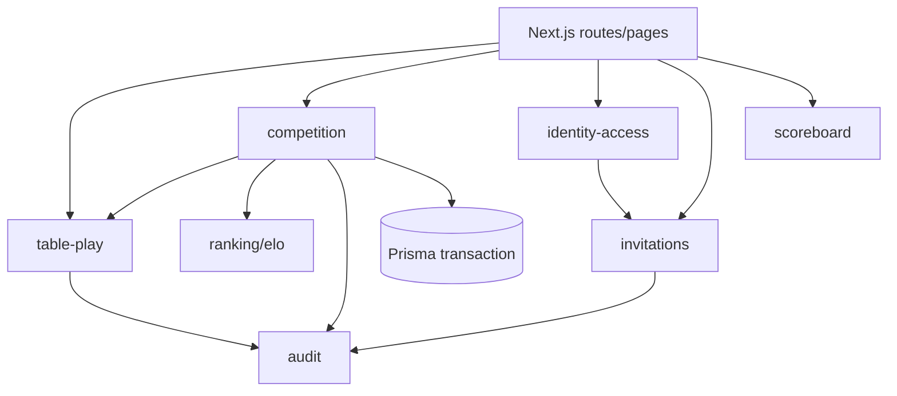

# Context Boundaries Design

**Spec**: `.specs/features/context-boundaries/spec.md`
**Status**: Draft

---

## Architecture Overview

The implementation will keep the app as a single Next.js modular monolith and introduce explicit context modules under `lib/contexts`.

Key rule: routes may orchestrate HTTP concerns, auth, request parsing, and response mapping; business invariants live in context modules.

## Code Reuse Analysis

| Existing Code | Reuse |
| --- | --- |
| `lib/tables/queue.ts` | Move/keep queue rotation as table-play domain logic. |
| `lib/ranking/elo.ts` | Reuse unchanged for Elo and win-rate calculations. |
| `lib/invitations.ts` | Reuse expiry presets and labels from shared invitation module. |
| `lib/auth/roles.ts` | Reuse role hierarchy and authorization predicates. |
| `lib/tables/queries.ts` | Split into table-play read models and competition read models. |
| `app/api/admin/_shared.ts` | Replace raw audit writes with audit context helpers while keeping route response behavior. |

## Components and Interfaces

### Shared Domain Contracts

- **Purpose**: Provide typed result and error contracts across context modules.
- **Location**: `lib/contexts/shared/domain-result.ts`
- **Interfaces**:
  - `type DomainResult<T> = { ok: true; value: T } | { ok: false; error: DomainError }`
  - `type DomainError = { context: string; code: string; message?: string; cause?: unknown }`
  - `function ok<T>(value: T): DomainResult<T>`
  - `function fail(error: DomainError): DomainResult<never>`
- **Dependencies**: none.

### Table Play Context

- **Purpose**: Own tables, memberships, participants, queue order, and current-player rules.
- **Location**: `lib/contexts/table-play`
- **Interfaces**:
  - `ensureTableMembership(tx, input): DomainResult<TableMembershipRef>`
  - `enqueueTableMember(tx, input): DomainResult<TableParticipantRef>`
  - `removeQueuedUser(tx, input): DomainResult<TableParticipantRef>`
  - `removeParticipant(tx, input): DomainResult<void>`
  - `getCurrentMatchParticipants(tx, tableId): DomainResult<[ParticipantRef, ParticipantRef]>`
  - `rotateQueueAfterFinishedMatch(tx, input): DomainResult<void>`
- **Dependencies**: Prisma transaction client; shared domain contracts.
- **Reuses**: existing `rotateQueueAfterMatch` behavior and queue-position update strategy.

### Competition Context

- **Purpose**: Own match lifecycle, Elo updates, match history, and rollback.
- **Location**: `lib/contexts/competition`
- **Interfaces**:
  - `finishMatch(tx, input): DomainResult<FinishedMatchDto>`
  - `rollbackMatch(tx, input): DomainResult<RollbackMatchDto>`
  - `getAdminRounds(input): Promise<PaginatedRoundsDto>`
  - `mapCompetitionErrorToHttp(error): { status: number; body: { error: string } }`
- **Dependencies**: table-play, audit, `lib/ranking/elo`, Prisma transaction client.
- **Reuses**: existing `MatchHistory` fields and ranking calculations.

### Invitations Context

- **Purpose**: Centralize expiration, one-time-use, and atomic claim policy.
- **Location**: `lib/contexts/invitations`
- **Interfaces**:
  - `isInvitationAvailable(invitation, now): boolean`
  - `buildOneTimeUseClaimWhere(baseWhere, invitation, now): object`
  - `createAccessInvitation(tx, input): DomainResult<AccessInvitationDto>`
  - `claimAccessInvitation(tx, input): DomainResult<AllowedEmailDto>`
  - `createTableInvitation(tx, input): DomainResult<TableInvitationDto>`
  - `claimTableInvitation(tx, input): DomainResult<{ tableId: string }>`
- **Dependencies**: audit, identity/access helpers, table-play for membership.
- **Reuses**: existing expiry presets from `lib/invitations.ts`.

### Audit Context

- **Purpose**: Hide `AuditLog` persistence behind typed events.
- **Location**: `lib/contexts/audit`
- **Interfaces**:
  - `recordAuditEvent(txOrPrisma, event): Promise<void>`
  - `recordAdminDenied(txOrPrisma, input): Promise<void>`
- **Dependencies**: Prisma client or transaction client.
- **Events**: `table_match_finished`, `table_match_rolled_back`, `table_queue_joined`, `table_queue_left`, `table_joined_via_invitation`, `invitation_used`, `admin_action_denied`.

### Identity Access Context

- **Purpose**: Keep auth/session/roles and access allowlist logic explicit.
- **Location**: `lib/contexts/identity-access`
- **Interfaces**:
  - Re-export or move `roles`, `hasRole`, `canAccessAdmin`, `canManageUser`, `canChangeRole`, `canDeleteUser`.
  - `allowEmail(txOrPrisma, input): Promise<AllowedEmailDto>`
  - `normalizeEmail(email): string`
  - `isValidEmail(email): boolean`
- **Dependencies**: Prisma client where persistence is needed.

### Scoreboard Context

- **Purpose**: Keep live scoreboard state and Firebase path behavior behind a context adapter.
- **Location**: `lib/contexts/scoreboard`
- **Interfaces**:
  - `getCurrentScoreboardPath(tableId): string`
  - existing `ScoreboardState` functions moved or re-exported.
- **Dependencies**: Firebase adapter for UI components.

## Error Handling Strategy

| Scenario                     | Domain Code                         | HTTP Mapping |
|------------------------------|-------------------------------------|--------------|
| Table not found              | `table_not_found`                   | 404          |
| User not found               | `user_not_found`                    | 400          |
| User not member              | `user_not_in_table`                 | 403          |
| User already queued          | `user_already_queued`               | 400          |
| Current player leaving queue | `current_player_cannot_leave_queue` | 400          |
| Not enough players           | `not_enough_players`                | 400          |
| Winner not in current match  | `winner_not_in_current_match`       | 400          |
| Match not found              | `match_not_found`                   | 404          |
| Rollback of rollback         | `cannot_rollback_rollback`          | 400          |
| Already rolled back          | `match_already_rolled_back`         | 409          |
| Ranking missing              | `ranking_not_found`                 | 409          |
| Invitation unavailable       | `invitation_unavailable`            | 400          |

Routes should map typed errors to the same user-facing messages currently used.

## Data Model Strategy

- Keep Prisma models unchanged in the first pass.
- Context modules may use Prisma internally, but external context contracts should expose DTOs and refs:
  - `UserRef`: `{ id: string }`
  - `ParticipantRef`: `{ id: string; userId: string; queuePosition: number }`
  - `FinishedMatchDto`: existing response subset from match finalization.
  - `RoundAdminItem`: existing admin round presentation shape.

## Tech Decisions

| Decision    | Choice                                       | Rationale                                                         |
|-------------|----------------------------------------------|-------------------------------------------------------------------|
| Module root | `lib/contexts/*`                             | Makes bounded contexts visible without moving Next.js app routes. |
| Persistence | Keep Prisma access inside contexts/use cases | Reduces page/route model coupling incrementally.                  |
| Errors      | Typed `DomainResult`                         | Avoids route branching on raw strings.                            |
| Schema      | No migration in first pass                   | Reduces risk while changing architecture.                         |
| Tests       | Unit-first with route regressions            | Most coupling is business logic, not UI.                          |
