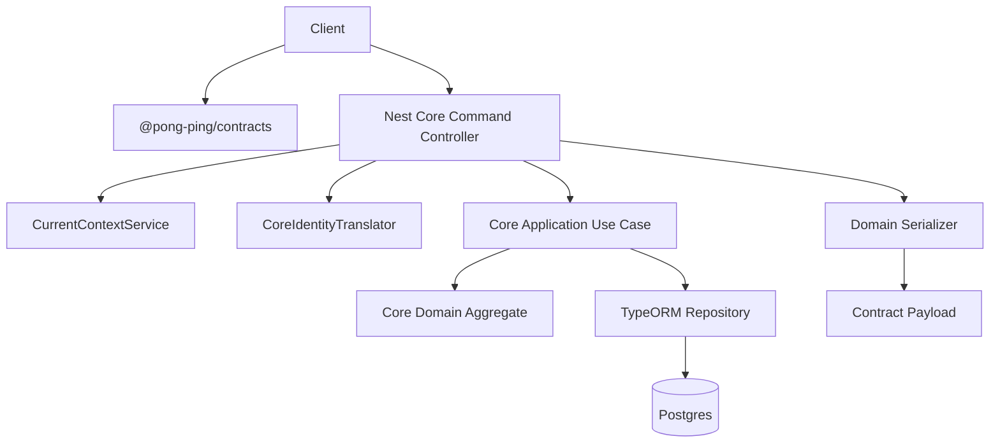

# Core Command Contracts and Controllers Design

**Spec**: `.specs/features/core-command-contracts-controllers/spec.md`  
**Context**: `.specs/features/core-command-contracts-controllers/context.md`  
**Status**: Draft

---

## Architecture Overview

Add a contract-first HTTP command layer over the existing persisted core application layer. Controllers stay thin: validate DTOs, resolve tenant/principal context, invoke use cases, and serialize domain results into JSON-safe response contracts.

`mermaid-studio` is not installed in this session, so the diagram is inline Mermaid.



---

## Code Reuse Analysis

### Existing Components to Leverage

| Component | Location | How to Use |
| --- | --- | --- |
| Contracts entrypoint | `packages/contracts/src/index.ts` | Re-export new core contracts from the existing package surface. |
| Identity DTO pattern | `apps/api/src/modules/identity/system/dtos/system-admin.dtos.ts` | DTO classes implement contract interfaces and define Swagger/validation decorators. |
| Swagger envelope helpers | `apps/api/src/common/shared/http/api-response.swagger.ts` | Document success/error envelopes for new controllers. |
| Identity auth decorators | `apps/api/src/modules/identity/authorization/authorization.decorators.ts` | Apply tenant-role requirements to core command routes. |
| Current request context | `apps/api/src/common/context/current-context.service.ts` | Resolve tenant id and identity principal inside controllers. |
| Core identity translator | `apps/api/src/modules/core/application/identity/core-identity-translator.ts` | Convert identity principal user id into core `ActorId`. |
| Existing use-case provider style | Core `*.module.ts` files | Register pure use cases through Nest factories. |
| Existing repository pattern | Core `infrastructure/typeorm/repositories` | Persist aggregate mutations through repositories only. |

### Integration Points

| System | Integration Method |
| --- | --- |
| API contracts | Add core contract types and constants, exported from package entrypoint. |
| Nest API | Add command controllers to existing core submodules. |
| Identity module | Use existing global guard plus tenant-role metadata; no new auth mechanism. |
| TypeORM repositories | Reuse existing persisted aggregate repositories; add repository methods only where use cases need them. |
| Global exception filter | Add `DomainRuleViolation` normalization before generic `HttpException` handling. |

---

## Components

### Core Contracts

- **Purpose**: Define framework-neutral JSON request/response payloads for core command endpoints.
- **Location**: `packages/contracts/src/core.ts`, re-exported by `packages/contracts/src/index.ts`.
- **Interfaces**:
  - Request contracts for club, athlete, table, and competition commands.
  - Response contracts for club, athlete profile, table state, queue entries, active game, game record, rating delta.
- **Dependencies**: Existing `ISODateString` type from contracts package.
- **Reuses**: Existing identity contract export style and const-object enum pattern.

### Core DTOs

- **Purpose**: Bridge HTTP validation/Swagger docs to framework-neutral core contracts.
- **Location**: `apps/api/src/modules/core/**/presentation/http/dtos/` or capability-local `dtos/` if following existing identity placement more closely.
- **Interfaces**: DTO classes implement matching contract interfaces.
- **Dependencies**: `class-validator`, `@nestjs/swagger`, domain literal constants where needed.
- **Reuses**: Identity DTO implementation pattern.

### Application Use Cases For Missing Persisted Commands

- **Purpose**: Preserve domain/application boundaries for aggregate methods not currently exposed as use cases.
- **Location**: existing `apps/api/src/modules/core/**/application/use-cases/` folders.
- **Interfaces**:
  - Club: change slug, activate, deactivate.
  - Table: create, rename, remove from active game.
  - Rating: no standalone manual correction endpoint unless explicitly implemented as an admin command; competition remains rating owner for game-driven deltas.
- **Dependencies**: Existing repositories and domain value objects.
- **Reuses**: Existing `CreateClubUseCase`, `RenameClubUseCase`, table helper patterns, and module factory providers.

### Core Command Controllers

- **Purpose**: Expose persisted command use cases over tenant-authenticated HTTP.
- **Location**: capability-local controller files, for example `apps/api/src/modules/core/table/table-command.controller.ts`.
- **Interfaces**:
  - Controller methods accept route params and DTO bodies.
  - Controller methods return serialized contract payloads.
- **Dependencies**: Use cases, `CurrentContextService`, `CoreIdentityTranslator`, serializers.
- **Reuses**: Existing identity controller route/decorator style.

### Domain Serializers

- **Purpose**: Convert domain aggregates/value objects into JSON-safe contract payloads.
- **Location**: capability-local serializer files, for example `apps/api/src/modules/core/table/table-contract.serializer.ts`.
- **Interfaces**:
  - `toClubResponse(club): ClubResponseContract`
  - `toAthleteResponse(athlete): AthleteResponseContract`
  - `toTableResponse(table): TableResponseContract`
  - `toGameRecordResponse(record): GameRecordResponseContract`
- **Dependencies**: Domain aggregate APIs and contract response types.
- **Reuses**: Existing service DTO mapping style from `SystemAdminService`.

### Domain Error Mapping

- **Purpose**: Ensure domain rule failures produce stable API envelopes.
- **Location**: `apps/api/src/common/shared/filters/global-exception.filter.ts`.
- **Interfaces**:
  - Detect `DomainRuleViolation`.
  - Map `*_not_found` to 404.
  - Map conflict-like codes to 409.
  - Map remaining domain codes to 400.
- **Dependencies**: `DomainRuleViolation` from core shared domain and existing app error code constants.
- **Reuses**: Existing global exception envelope construction.

---

## Contract Model Sketch

```ts
type CorePlayModeContract = "singles" | "doubles";
type AthleteTechnicalLevelContract = "beginner" | "intermediate" | "advanced" | "competitive";
type AthleteGripStyleContract = "classic" | "penhold";
type AthletePlayingStyleContract = "offensive" | "defensive" | "all_round";

interface AthleteProfileContract {
  technicalLevel: AthleteTechnicalLevelContract | null;
  gripStyle: AthleteGripStyleContract | null;
  playingStyle: AthletePlayingStyleContract | null;
  bladeName: string | null;
  forehandRubberName: string | null;
  backhandRubberName: string | null;
  equipmentNotes: string | null;
}

interface TableResponseContract {
  id: string;
  clubId: string;
  name: string;
  playMode: CorePlayModeContract;
  createdByAthleteId: string;
  createdAt: ISODateString;
  members: { athleteId: string; joinedAt: ISODateString }[];
  queue: { athleteId: string; position: number; joinedAt: ISODateString }[];
}
```

Response contracts should include enough state for clients to update UI after commands without adding query endpoints in this feature.

---

## Endpoint Map

| Command | Route | Roles | Requirement |
| --- | --- | --- | --- |
| Create club | `POST /core/clubs` | admin | CORE-HTTP-02, CORE-HTTP-03 |
| Rename current club | `PATCH /core/clubs/current/name` | admin | CORE-HTTP-02, CORE-HTTP-03 |
| Change current club slug | `PATCH /core/clubs/current/slug` | admin | CORE-HTTP-02, CORE-HTTP-03 |
| Activate/deactivate current club | `POST /core/clubs/current/activate`, `POST /core/clubs/current/deactivate` | admin | CORE-HTTP-02, CORE-HTTP-03 |
| Register athlete | `POST /core/athletes` | member/admin | CORE-HTTP-02 |
| Update athlete profile | `PATCH /core/athletes/:athleteId/profile` | member/admin | CORE-HTTP-02 |
| Create table | `POST /core/tables` | admin | CORE-HTTP-02, CORE-HTTP-03 |
| Rename table | `PATCH /core/tables/:tableId/name` | admin | CORE-HTTP-02, CORE-HTTP-03 |
| Enqueue athlete | `POST /core/tables/:tableId/queue` | member/admin | CORE-HTTP-02 |
| Remove queued athlete | `DELETE /core/tables/:tableId/queue/:athleteId` | member/admin | CORE-HTTP-02 |
| Remove active athlete | `DELETE /core/tables/:tableId/active-game/:athleteId` | member/admin | CORE-HTTP-02, CORE-HTTP-03 |
| Form active game | `POST /core/tables/:tableId/active-game` | member/admin | CORE-HTTP-02 |
| Rotate winner stays | `POST /core/tables/:tableId/rotate-winner-stays` | member/admin | CORE-HTTP-02 |
| Record game | `POST /core/tables/:tableId/games` | member/admin | CORE-HTTP-02 |
| Correct game | `POST /core/games/:gameRecordId/corrections` | admin | CORE-HTTP-02 |

---

## Error Handling Strategy

| Error Scenario | Handling | User Impact |
| --- | --- | --- |
| Invalid request body | Existing validation pipe returns 400 envelope. | Client sees validation details. |
| Missing tenant/principal | Existing context/auth path returns 401/403 envelope. | Client can prompt login or show permission error. |
| Missing aggregate | `DomainRuleViolation` code ending in `_not_found` maps to 404. | Client can show not-found state. |
| Duplicate/conflicting domain rule | Conflict-like domain code maps to 409. | Client can show conflict/retry guidance. |
| Other domain invariant failure | Domain error maps to 400. | Client sees business-rule failure. |

---

## Tech Decisions

| Decision | Choice | Rationale |
| --- | --- | --- |
| Contract organization | Add `core.ts` and re-export from flat `index.ts`. | Avoid making `index.ts` too large while preserving current package import style. |
| Tenant to club mapping | `CurrentContextService.getTenantOrThrow().id` becomes core `clubId`. | User selected this and it matches existing tenant resolution. |
| Domain-only modules | Defer `invitation` and `scoreboard`. | No persistence/application layer exists yet. |
| Controller outputs | Serializer functions return contracts. | Prevents value-object leakage and avoids duplicating mapping in each controller. |
| Exception handling | Central filter maps `DomainRuleViolation`. | Keeps controllers thin and consistent. |

