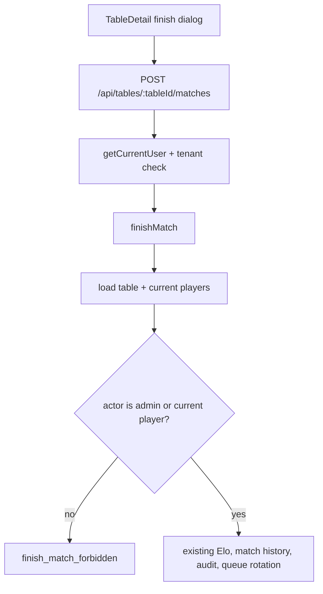

# Current Round Player Match Finish Design

**Spec**: `.specs/features/current-round-player-match-finish/spec.md`
**Status**: Implemented

---

## Architecture Overview

The current failure is route-level authorization: `app/api/admin/tables/[tableId]/matches/route.ts` calls `requireAdmin`, while `lib/contexts/competition/finishMatch` assumes the caller is already allowed. The refactor should make match finish a tenant-authenticated table operation and move actor eligibility into the competition use case.



Admin-specific rollback routes stay under `/api/admin/...` and continue to use `requireAdmin`.

---

## Code Reuse Analysis

### Existing Components to Leverage

| Component | Location | How to Use |
| --- | --- | --- |
| `finishMatch` | `lib/contexts/competition/use-cases.ts` | Extend input with actor authorization context and enforce current-player eligibility before writes. |
| `getCurrentMatchParticipants` | `lib/contexts/table-play/index.ts` | Reuse the current two-player lookup for both winner validation and actor eligibility. |
| `mapCompetitionErrorToHttp` | `lib/contexts/competition/errors.ts` | Add a `finish_match_forbidden` mapping to `403`. |
| `getCurrentUser` + `getActorTenantId` | `app/api/tables/[tableId]/queue/route.ts` | Follow the existing non-admin table route auth pattern. |
| `TableDetail` | `components/tables/table-detail.tsx` | Reuse the existing finish dialog and toasts; widen render eligibility from `canManage` to `canManage || viewerIsPlaying`. |
| Competition route tests | `__tests__/unit/competition/match-routes.test.ts` | Extend the mocked route coverage for player actors and forbidden non-participants. |
| Competition use-case tests | `__tests__/unit/competition/match-use-cases.test.ts` | Add pure domain tests around actor eligibility before writes. |

### Integration Points

| System | Integration Method |
| --- | --- |
| Next route handlers | Add `app/api/tables/[tableId]/matches/route.ts` as the player-accessible finish endpoint. Keep or delegate the admin route for backwards compatibility. |
| Prisma transaction | Preserve `prisma.$transaction` around `finishMatch`. |
| Audit | Preserve `table_match_finished`, using the actual actor user id whether admin or player. |
| UI read model | Existing `viewerIsPlaying` is already computed in `getTableDetail`; no new database field is required. |

---

## Components

### Competition Finish Authorization

- **Purpose**: Ensure match finish can only be performed by admins/superadmins or the current round players.
- **Location**: `lib/contexts/competition/use-cases.ts`
- **Interface**:
  - Extend `finishMatch(tx, input)` with `actorCanManageTable: boolean`
  - Add `finish_match_forbidden` to `CompetitionErrorCode`
- **Dependencies**: `getCurrentMatchParticipants`, current role gate computed by routes.
- **Reuses**: Existing winner validation and match write orchestration.

Authorization should run after table/current-player lookup and before ranking upserts, match history creation, audit, or queue rotation:

```typescript
const actorIsCurrentPlayer = currentPlayers.some(
  (participant) => participant.userId === input.actorUserId,
);

if (!input.actorCanManageTable && !actorIsCurrentPlayer) {
  return fail(competitionError("finish_match_forbidden"));
}
```

### Player Match Finish Route

- **Purpose**: Provide an authenticated tenant route for current players to finish matches.
- **Location**: `app/api/tables/[tableId]/matches/route.ts`
- **Interface**:
  - `POST(request, context)` with body `{ winnerParticipantId: string }`
- **Dependencies**: `getCurrentUser`, `getActorTenantId`, `canAccessAdmin`, `prisma`, `finishMatch`, `mapCompetitionErrorToHttp`.
- **Reuses**: Auth/tenant pattern from `app/api/tables/[tableId]/queue/route.ts`.

The route should pass `actorCanManageTable: canAccessAdmin(actor.role)`.

### Admin Match Finish Route Compatibility

- **Purpose**: Keep existing admin route behavior and response shape for current callers/tests.
- **Location**: `app/api/admin/tables/[tableId]/matches/route.ts`
- **Interface**:
  - Continue `POST(request, context)` with body `{ winnerParticipantId: string }`
- **Dependencies**: `requireAdmin`, `finishMatch`.
- **Reuses**: Existing admin route tests.

This route should call `finishMatch` with `actorCanManageTable: true`, or delegate to a shared route helper to avoid duplicate body parsing and response mapping.

### Table Detail Finish UI

- **Purpose**: Show and submit finish controls for eligible actors.
- **Location**: `components/tables/table-detail.tsx`
- **Interfaces**:
  - Derive `viewerCanFinishRound = roundIsActive && (canManage || table.viewerIsPlaying)`
  - Update `finishMatch` fetch URL to `/api/tables/${table.id}/matches`
- **Dependencies**: Existing `viewerIsPlaying` read model and dialog UI.
- **Reuses**: Existing finish dialog, pending state, toasts, and `router.refresh()`.

Rollback buttons must continue using `/api/admin/.../rollback` and `canManage`.

---

## Data Models

No schema migration is required.

### `finishMatch` Input

```typescript
type FinishMatchInput = {
  actorUserId: string;
  actorCanManageTable: boolean;
  tenantId: string;
  tableId: string;
  winnerParticipantId: string;
};
```

### Competition Error

```typescript
type CompetitionErrorCode =
  | "finish_match_forbidden"
  | /* existing codes */;
```

HTTP mapping:

| Error | Status | Message |
| --- | --- | --- |
| `finish_match_forbidden` | `403` | `Apenas jogadores da rodada atual ou admins podem encerrar a rodada.` |

---

## Error Handling Strategy

| Error Scenario | Handling | User Impact |
| --- | --- | --- |
| Unauthenticated finish request | Route returns `401` before transaction | Toast shows existing API error. |
| Missing tenant context | Route returns `403` before transaction | No table state leaked. |
| Cross-tenant table id | `finishMatch` returns `table_not_found` | Existing 404 response. |
| Actor is not admin/current player | `finish_match_forbidden` from use case | 403 response; no writes. |
| Winner is stale/not current | Existing `winner_not_in_current_match` | 400 response; UI can refresh after error if desired. |
| Fewer than two players | Existing `not_enough_players` | 400 response. |

---

## Tech Decisions

| Decision | Choice | Rationale |
| --- | --- | --- |
| Authorization location | Enforce in `finishMatch` instead of only in route | Prevents future routes or admin-route reuse from bypassing player eligibility. |
| Player endpoint path | Add `/api/tables/[tableId]/matches` | Existing `/api/tables/...` routes already represent authenticated tenant table actions. |
| Admin compatibility | Keep admin route and pass `actorCanManageTable: true` | Reduces regression risk for existing admin UI/tests and external callers. |
| UI eligibility | `canManage || viewerIsPlaying` | Matches backend permission while hiding finish controls from spectators. |
| Rollback | No change | Player finish permission does not imply score rollback permission. |
