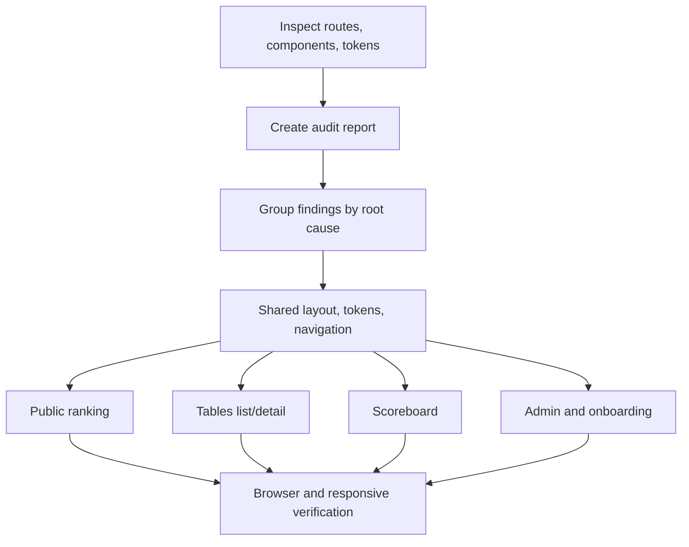

# Design Quality Audit & Refactor Design

**Spec**: `.specs/features/design-quality-refactor/spec.md`
**Status**: Draft

---

## Architecture Overview

The refactor should run as two connected tracks:

1. Audit the current app and convert findings into a prioritized backlog.
2. Implement shared foundations first, then route-level improvements from highest-traffic/highest-risk surfaces outward.

## Current Surface Inventory

| Surface | Representative Files | Primary Risks |
| --- | --- | --- |
| Public ranking | `app/page.tsx`, `components/pagination-controls.tsx` | Dense table-first layout, weak first impression, mobile overflow risk, generic card styling |
| Authenticated shell | `components/app-layout.tsx`, `components/app-sidebar.tsx`, `components/app-breadcrumbs.tsx` | Missing explicit skip-link/main-region strategy, repeated default spacing, sidebar active/admin hierarchy issues |
| Tables list | `app/(app)/tables/page.tsx`, `components/tables/table-list.tsx` | Repeated card structure, nested bordered panels, unclear destructive hierarchy, long-name overflow risk |
| Table detail | `components/tables/table-detail.tsx` | Too many equivalent cards, action hierarchy competes with state panels, admin/player tasks mixed |
| Scoreboard | `components/scoreboard/realtime-scoreboard.tsx`, `components/scoreboard/scoreboard-controls.tsx` | Separate visual language from app shell, large display needs distance/touch validation, dark-only affordances |
| Admin data | `app/admin/users/users-admin.tsx`, `app/admin/access/access-admin.tsx`, `app/admin/tenants/tenants-admin.tsx`, `app/admin/rounds/rounds-admin.tsx` | Dense tables, mobile reachability, row-level pending states, destructive action clarity |
| Onboarding/invites | `app/login/page.tsx`, `app/invite/[token]/invite-form.tsx`, `app/table-invite/[token]/table-invite-form.tsx` | Generic centered card, copy tone, form metadata, error recovery |
| Shared primitives | `components/ui/*`, `app/globals.css` | Default shadcn look, Inter/system-like token choices, generic shadows, possible transition/focus inconsistencies |

## Preliminary Findings From Code Read

These are not the final audit, but they shape the implementation plan:

| Finding | Evidence | Requirement |
| --- | --- | --- |
| App leans on default card/table composition rather than a product-specific workflow layout. | `app/page.tsx`, `components/tables/table-list.tsx`, `components/tables/table-detail.tsx` | DQR-03, DQR-04, DQR-08 |
| Public ranking is a table inside a card with limited hierarchy beyond the page title. | `app/page.tsx` | DQR-03 |
| Table detail mixes queue, current match, stats, participation, invite creation, and history as similar-weight cards. | `components/tables/table-detail.tsx` | DQR-04 |
| Scoreboard uses a bespoke dark brutal utility style that may be appropriate for display use but is disconnected from app-level visual tokens. | `components/scoreboard/realtime-scoreboard.tsx`, `components/scoreboard/scoreboard-controls.tsx` | DQR-05, DQR-08 |
| Several Portuguese labels omit accents, reducing perceived polish and consistency. | `app/page.tsx`, `app/login/page.tsx`, `components/tables/table-detail.tsx`, `components/pagination-controls.tsx` | DQR-07, DQR-08 |
| Destructive actions are not consistently styled as destructive. | `components/tables/table-list.tsx`, `components/tables/table-detail.tsx` | DQR-04, DQR-06 |
| Global tokens use a narrow neutral/orange theme and generic shadows, producing a default admin-template feel. | `app/globals.css` | DQR-02, DQR-08 |
| Placeholder text currently uses plain examples without the guideline-preferred ellipsis pattern. | `app/login/page.tsx` | DQR-07 |

## Code Reuse Analysis

### Existing Components to Leverage

| Component | Location | How to Use |
| --- | --- | --- |
| shadcn/Radix primitives | `components/ui/*` | Keep as interaction/accessibility base; adjust variants and composition patterns rather than replacing. |
| App shell | `components/app-layout.tsx`, `components/app-sidebar.tsx` | Add skip-link/main strategy, improve hierarchy, keep auth provider and sidebar provider. |
| Pagination | `components/pagination-controls.tsx` | Preserve URL state and reuse on ranking/tables/admin lists. |
| Avatar/user helpers | `components/user-avatar.tsx`, `lib/client-utils.ts` | Continue using for identity display and formatting; improve wrapping/truncation patterns around them. |
| Page skeletons | `components/page-skeletons.tsx` | Align skeleton density with refactored layouts. |
| Scoreboard domain functions | `lib/contexts/scoreboard` | Do not change scoring logic; refactor presentation around existing state functions. |

### Integration Points

| System | Integration Method |
| --- | --- |
| Next.js App Router | Keep existing route files and server/client boundaries. Any framework-specific implementation should read local `node_modules/next/dist/docs/` before code changes. |
| NextAuth session | Preserve `auth()`, `requireAuth()`, tenant redirects, and role checks. |
| Firebase realtime scoreboard | Preserve `onValue`, `runTransaction`, `set`, and current path/state semantics. |
| Prisma-backed queries | Preserve DTO contracts exposed by existing query/use-case layers. |
| shadcn/Radix | Reuse accessible primitives for dialogs, selects, sidebar, buttons, tables, cards. |

## Target Design Direction

The product should feel like a focused club operations console for table tennis: energetic where match state matters, quiet where admins need to scan data, and credible on the public ranking page.

| Dimension | Direction |
| --- | --- |
| Tone | Industrial sport console: crisp, high-contrast, score-first, restrained admin density |
| Typography | Keep implementation conservative unless a font change is explicitly chosen; improve hierarchy, tabular numbers, wrapping, and line lengths first |
| Color | Move from generic orange/neutral repetition to a small sport palette: court green, ball amber, ink neutral, destructive red, scoreboard dark |
| Layout | Use full-width bands and clear workflow regions; reserve cards for repeated items/tools, not every section |
| Interaction | Primary actions should match the user's task: play/join/score actions stronger than metadata actions; destructive actions clearly separated |
| Motion | Minimal and state-driven; honor `prefers-reduced-motion`; no decorative motion needed |

## Components and Patterns

### Audit Report

- **Purpose**: Store final design flaws and mappings to refactor tasks.
- **Location**: `.specs/features/design-quality-refactor/audit.md`
- **Interfaces**:
  - Finding fields: `id`, `severity`, `route`, `file`, `line`, `category`, `viewport`, `issue`, `fixDirection`, `requirements`.
- **Dependencies**: Web Interface Guidelines, frontend design quality bar, manual browser screenshots.
- **Reuses**: Existing spec traceability style.

### Shared Page Shell Pattern

- **Purpose**: Standardize main regions, page headers, actions, and responsive content gutters.
- **Location**: likely `components/app-layout.tsx`, plus optional new component under `components/page-shell.tsx`.
- **Interfaces**:
  - `PageShell({ title, description, action, children })`
  - `SectionHeader({ title, description, action })`
- **Dependencies**: Existing sidebar/breadcrumb layout.
- **Reuses**: Existing `AppLayout`, `AppBreadcrumbs`, shadcn `Button`.

### Ranking Presentation Pattern

- **Purpose**: Make public rankings scannable on mobile and credible on desktop.
- **Location**: likely extracted from `app/page.tsx` to `components/rankings/*`.
- **Interfaces**:
  - `RankingBoard({ rankings, pageInfo, searchParams, tenant })`
  - `RankingRow` or responsive ranking item.
- **Dependencies**: `getPublicRankings`, `PaginationControls`.
- **Reuses**: `Badge`, `Table`, `UserAvatar`, ranking DTOs.

### Table Workflow Pattern

- **Purpose**: Separate current match, queue, participation, admin entry, and history into clear workflow regions.
- **Location**: `components/tables/table-list.tsx`, `components/tables/table-detail.tsx`, optional `components/tables/table-workflow-*`.
- **Interfaces**:
  - `CurrentMatchPanel`, `QueuePanel`, `ViewerParticipationPanel`, `AdminEntryPanel`, `MatchHistoryPanel`.
- **Dependencies**: Current table DTOs and API routes.
- **Reuses**: Existing action handlers and domain DTOs.

### Scoreboard Display Pattern

- **Purpose**: Preserve realtime logic while improving shared-display readability and touch controls.
- **Location**: `components/scoreboard/realtime-scoreboard.tsx`, `components/scoreboard/scoreboard-controls.tsx`.
- **Interfaces**:
  - Presentation-only subcomponents for player panels, set/point display, control clusters.
- **Dependencies**: Firebase adapter and scoreboard context functions.
- **Reuses**: Current mutation functions and tests.

### Admin Data Pattern

- **Purpose**: Standardize admin table density, mobile adaptation, row actions, pending states, and empty states.
- **Location**: `app/admin/*/*.tsx`, optional shared `components/admin/*`.
- **Interfaces**:
  - `AdminDataHeader`, `AdminTableToolbar`, `RowActionGroup`, `AdminEmptyState`.
- **Dependencies**: Existing admin route data.
- **Reuses**: `Table`, `Dialog`, `Select`, `Badge`, `PaginationControls`.

## Error Handling Strategy

| Error Scenario | Handling | User Impact |
| --- | --- | --- |
| Audit cannot run a route due missing seed/session | Mark as blocked with route, missing state, and fallback code review finding | Refactor does not pretend the route was visually verified |
| Browser screenshot differs from code assumption | Screenshot evidence wins; task updates audit before implementation | Reduces subjective refactor drift |
| Refactor breaks API/domain behavior | Revert or adjust UI layer only; domain behavior is out of scope | User workflows remain stable |
| Realtime scoreboard write fails | Preserve existing toast behavior while improving presentation/accessibility | No scoring behavior regression |

## Tech Decisions

| Decision | Choice | Rationale |
| --- | --- | --- |
| Refactor order | Audit -> shared foundations -> core flows -> secondary flows -> polish | Prevents route-specific patchwork and repeated fixes. |
| Component base | Keep shadcn/Radix primitives | Existing components already provide accessible behavior and app consistency. |
| Visual identity | Sport-console direction, not marketing hero | App is an operational tool and scoreboard, not a landing page. |
| Verification | Combine lint/test/build with browser visual checks | Design flaws often escape unit tests. |
| Documentation | Store audit and plan in `.specs/features/design-quality-refactor` | Matches existing repo spec workflow. |

## Verification Plan

- `pnpm lint`
- `pnpm test`
- `pnpm build`
- Browser review at minimum widths: 375, 768, 1280, and scoreboard fullscreen desktop.
- Keyboard pass on primary flows: `/`, `/tables`, table detail, scoreboard controls, `/admin/users`, `/login`.
- Visual evidence saved or referenced in `audit.md` before closing DQR-01.
