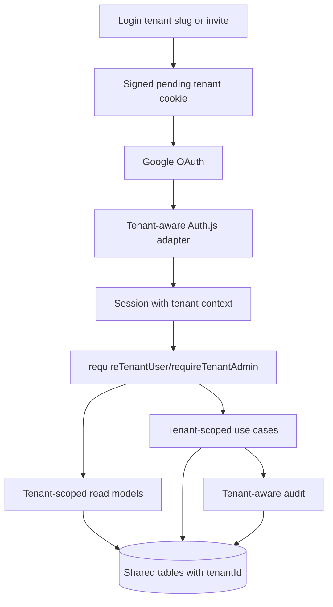

# Multitenancy Design

**Spec**: `.specs/features/multitenancy/spec.md`
**Status**: Draft

---

## Architecture Overview

The implementation keeps the app as a shared-table modular monolith. Tenant context enters through a trusted login/invitation flow, becomes part of the authenticated session, and is then passed into tenant-owned query and use-case boundaries.

## Data Model Strategy

- `Tenant` remains the root tenant model with unique `slug`.
- `User.email` changes from global unique to tenant-scoped unique: `@@unique([tenantId, email])`.
- `User.googleId` must not remain globally unique. Either remove it or scope uniqueness by `(tenantId, googleId)` if it is still needed for display/support.
- `Account` gains `tenantId` and uses `@@unique([tenantId, provider, providerAccountId])`.
- `AllowedEmail.email` changes from global unique to `@@unique([tenantId, email])`.
- `AuthInvitation`, `PingPongTableInvitation`, `AuditLog`, `PlayerRanking`, `MatchHistory`, `PingPongTable`, `PingPongTableMember`, and `PingPongTableParticipant` keep required `tenantId`.
- Existing data is backfilled to `default` tenant before non-null and foreign-key constraints are enforced.
- Compound tenant indexes should exist on high-volume list or lookup paths: users, allowed emails, invitations, rankings, matches, tables, members, participants, and audit logs.

## Authentication Design

### Pending Tenant

- Add a server-only pending tenant helper that can set, read, and clear a short-lived signed/HttpOnly cookie.
- Login by slug validates the tenant exists before setting the pending tenant cookie.
- Invite entry points set pending tenant from the stored invitation tenant before sending the user to Google login when needed.
- The pending tenant contains the tenant id and slug, not user-controlled authorization state.

### Tenant-Aware Auth.js Adapter

- Replace direct `PrismaAdapter(prisma)` usage with a wrapper or custom adapter that uses the current pending tenant during OAuth user/account lookup and creation.
- `getUserByEmail(email)` becomes tenant-scoped and uses `(tenantId, email)`.
- `getUserByAccount(provider_providerAccountId)` becomes tenant-scoped and includes `tenantId`.
- `createUser(data)` writes `tenantId` and normalized email.
- `linkAccount(data)` writes `tenantId`.
- Session operations can remain keyed by globally unique session token, but returned users include tenant fields.
- If pending tenant is required and missing during account lookup or user creation, sign-in fails safely.

### Session and Current User

- Extend `types/next-auth.d.ts` with `tenantId`, `tenantSlug`, and `tenantName`.
- Update `callbacks.session` to populate tenant context from the database user.
- Update `getCurrentUser()` to select tenant fields and return a tenant-aware user.
- Add `requireTenantUser()` and `requireTenantAdmin()` wrappers for tenant-owned routes/pages.

## Tenant Scope Boundaries

Add small helpers instead of repeating raw tenant filters everywhere:

- `withTenant(where, tenantId)` or model-specific query helpers where useful.
- `requireTenantUser()` for authenticated tenant pages and route handlers.
- `requireTenantAdmin(reason)` for tenant admin actions.
- Domain inputs should include `tenantId` or an actor object `{ id, tenantId, role }`.

Tenant-owned modules to update:

- Identity/access: allowed emails, sign-in policy, user management.
- Invitations: access invitations and table invitations.
- Table play: membership, queue, participant removal, current-player lookup, queue rotation.
- Competition: finish match, rollback, admin rounds query.
- Rankings: public rankings are tenant-local rankings for the signed-in user's tenant.
- Tables: list/detail/user options/scoreboard query and admin table APIs.
- Audit: all event writes include tenant id.

## UI Design

- Login page adds a tenant slug step or tenant-aware invite path before Google sign-in.
- Superadmin gets global tenant management pages for listing and creating tenants.
- Tenant admins keep the current admin surfaces, but all data is scoped to their tenant.
- Admin page copy should make tenant scope visible without exposing tenant switching through arbitrary query params.
- Existing cards/components can be reused; no visual redesign is required beyond the new tenant management flows.

## Authorization and Error Handling

| Scenario | Response |
| --- | --- |
| No authenticated user | 401 for route handlers, redirect to login for pages |
| Authenticated user without tenant on tenant route | 403 or login error, depending on route context |
| Tenant-owned resource id from another tenant | 404 |
| Same-tenant user lacks required role | 403 |
| Missing/expired pending tenant during OAuth | Redirect to login with tenant-context error |
| Invalid invitation token | Existing invalid/expired/used invitation error |

## Migration Strategy

1. Adjust Prisma schema to tenant-scoped identity constraints.
2. Add migration that backfills default tenant for existing data, adds `Account.tenantId`, updates unique indexes, and preserves current rows.
3. Generate Prisma client.
4. Update auth adapter and session helpers before enabling tenant-scoped application queries.
5. Migrate routes/use cases by subsystem with cross-tenant tests.

## Risks

| Risk | Mitigation |
| --- | --- |
| Auth.js adapter assumes globally unique email | Replace/wrap adapter methods that resolve users/accounts. |
| OAuth callback lacks pending tenant | Fail sign-in safely and tell user to restart login. |
| Missed tenant filter leaks data | Centralize helpers and add cross-tenant regression tests. |
| Existing tests use minimal user mocks | Update test fixtures to include `tenantId` and tenant fields. |
| Unique constraint migration conflicts | Backfill and deduplicate default-tenant data before enforcing compound uniques. |
