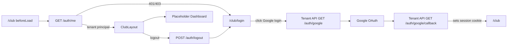

# Tenant Club Login And Dashboard Shell Design

**Spec**: `.specs/features/tenant-club-login-dashboard-shell/spec.md`
**Context**: `.specs/features/tenant-club-login-dashboard-shell/context.md`
**Status**: Draft

---

## Architecture Overview

Add a tenant-authenticated route group beside the existing system-admin route group in `apps/frontend`. The new tenant surface uses separate API helpers, query keys, routes, and layout components so tenant session state cannot be confused with system-admin session state.

TanStack Router v1.114.3 documentation confirms that file-based routes can use `beforeLoad` to validate auth and throw `redirect({ to, search })`, and that nested layout routes render child content through `Outlet`. This matches the existing `/admin` guard pattern in `apps/frontend/src/routes/admin.tsx`.



`mermaid-studio` is not installed in the available skills, so the diagram is inline Mermaid.

---

## Code Reuse Analysis

### Existing Components to Leverage

| Component | Location | How to Use |
| --- | --- | --- |
| API request envelope parser | `apps/frontend/src/lib/api/client.ts` | Reuse `apiRequest` for tenant `/auth/me` and `/auth/logout`; add a tenant login URL helper that uses the same base URL model unless tenant-host support requires a dedicated helper. |
| System auth query pattern | `apps/frontend/src/lib/api/system-admin.ts` | Mirror `queryOptions`, query keys, and logout mutation shape with tenant-specific names. |
| System protected route guard | `apps/frontend/src/routes/admin.tsx` | Mirror `beforeLoad` + `ensureQueryData` + `redirect` behavior for `/club`. |
| Admin layout shell | `apps/frontend/src/components/layout/admin-layout.tsx` | Reuse sidebar/header/logout interaction patterns but create a separate club layout to avoid system-admin labels and query keys. |
| Page shell and empty state | `apps/frontend/src/components/layout/page-shell.tsx` | Use for the placeholder dashboard page. |
| shadcn UI primitives | `apps/frontend/src/components/ui/*` | Use Button, Sidebar, Separator, Tooltip, Alert/Sonner patterns already present. |
| Existing design tokens | `apps/frontend/src/styles/globals.css` | Keep the same restrained dashboard visual language. |

### Integration Points

| System | Integration Method |
| --- | --- |
| TanStack Router | Add file routes for `/club/login` and `/club`; use route `beforeLoad` for auth. |
| TanStack Query | Add tenant auth query keys and `tenantMeQueryOptions`. |
| Nest tenant auth API | Call `/auth/me`, `/auth/logout`, and browser-navigate to `/auth/google` with credentials/cookies scoped to the tenant host. |
| Nest tenant OAuth callback | If callback still returns JSON, add/configure redirect support so browser OAuth lands back at `/club`. |

---

## Components

### Tenant Auth API Helpers

- **Purpose**: Encapsulate tenant auth endpoints and keep tenant query keys separate from system auth.
- **Location**: `apps/frontend/src/lib/api/tenant-auth.ts`
- **Interfaces**:
  - `tenantAuthKeys.me: readonly ["tenant-auth", "me"]` - tenant principal cache key.
  - `tenantMeQueryOptions(): QueryOptions<IdentityPrincipalResponseContract>` - returns `GET /auth/me` query options with no retry.
  - `getTenantMe(): Promise<IdentityPrincipalResponseContract>` - validates current tenant session.
  - `logoutTenantSession(): Promise<AuthLogoutResponseContract>` - revokes current tenant session.
  - `getTenantLoginUrl(redirect?: string): string` - returns the browser URL for `GET /auth/google`.
- **Dependencies**: `apiRequest`, `getApiBaseUrl`, `@pong-ping/contracts`, TanStack Query.
- **Reuses**: Existing system-admin API helper pattern.

### Club Login Page

- **Purpose**: Tenant-facing login page that starts Google OAuth and redirects authenticated tenant users to `/club`.
- **Location**: `apps/frontend/src/features/tenant-auth/club-login-page.tsx`
- **Interfaces**:
  - `ClubLoginPage(): JSX.Element`
- **Dependencies**: `tenantMeQueryOptions`, `getTenantLoginUrl`, `Button`, lucide icon.
- **Reuses**: `LoginPage` auth-check pattern, but with tenant copy and tenant endpoints.

### Club Protected Route

- **Purpose**: Enforce tenant authentication before rendering the club shell.
- **Location**: `apps/frontend/src/routes/club.tsx`
- **Interfaces**:
  - `beforeLoad({ context, location })` - ensures tenant auth query data and redirects to `/club/login`.
  - `component: ClubLayout`
- **Dependencies**: TanStack Router `createFileRoute`, `redirect`; TanStack Query context.
- **Reuses**: `apps/frontend/src/routes/admin.tsx` guard pattern.

### Club Login Route

- **Purpose**: Public tenant login route.
- **Location**: `apps/frontend/src/routes/club.login.tsx`
- **Interfaces**:
  - `validateSearch` for optional safe `redirect` search param if implemented.
  - `component: ClubLoginPage`
- **Dependencies**: TanStack Router file-based route generation.
- **Reuses**: Existing `/login` route structure.

### Club Layout

- **Purpose**: Authenticated dashboard shell for tenant users.
- **Location**: `apps/frontend/src/components/layout/club-layout.tsx`
- **Interfaces**:
  - `ClubLayout(): JSX.Element`
- **Dependencies**: `tenantMeQueryOptions`, `logoutTenantSession`, `tenantAuthKeys`, TanStack Router, TanStack Query, shadcn Sidebar/Button/Separator.
- **Reuses**: Admin layout sidebar/header/logout mechanics, not labels or query keys.

### Club Dashboard Placeholder

- **Purpose**: First child page rendered at `/club`, with clear placeholder content for future tenant workflows.
- **Location**: `apps/frontend/src/features/club/dashboard-shell-page.tsx`
- **Interfaces**:
  - `DashboardShellPage(): JSX.Element`
- **Dependencies**: `PageShell`, `EmptyState`, existing UI primitives.
- **Reuses**: `PageShell` and restrained dashboard tone.

### Tenant OAuth Redirect Support

- **Purpose**: Ensure browser-based tenant OAuth returns to the Vite club shell after session creation, if required by current backend behavior.
- **Location**: likely `apps/api/src/modules/identity/auth/auth.controller.ts`, `apps/api/src/common/config/config.module.ts`, and related tests.
- **Interfaces**:
  - Config option such as `TENANT_FRONTEND_URL` or an equivalent safe redirect source.
  - Callback behavior that sets the session cookie and redirects to `/club`.
- **Dependencies**: Nest ConfigService, existing cookie/session helpers.
- **Reuses**: `SystemAuthController.googleCallback` redirect pattern.

---

## Data Models

No new persisted data model is required.

Frontend API types reuse:

```typescript
import type {
  AuthLogoutResponseContract,
  IdentityPrincipalResponseContract,
} from "@pong-ping/contracts";
```

The tenant principal must be accepted only when:

```typescript
principal.tenantId !== null && principal.tenantRoles.length > 0
```

---

## Error Handling Strategy

| Error Scenario | Handling | User Impact |
| --- | --- | --- |
| `/auth/me` returns 401 or 403 in `/club` guard | Remove `tenantAuthKeys.me`; redirect to `/club/login` with `redirect: location.href`. | User sees login page. |
| `/auth/me` returns system principal with `tenantId: null` | Treat as invalid tenant auth and redirect to `/club/login`. | Prevents system sessions from entering tenant UI. |
| Login page auth probe fails with 401/403 | Render login normally. | User can start OAuth. |
| Login page auth probe succeeds | Navigate to `/club` or safe redirect search param. | Signed-in users skip login. |
| Logout API succeeds | Remove tenant auth cache; navigate to `/club/login`; show success toast if consistent with existing UI. | Session ends cleanly. |
| Logout API fails | Show toast error; do not navigate. | User remains in shell and can retry. |
| Tenant API base URL points at reserved host | Surface auth failure rather than switching to system auth. | Local setup problem is visible. |

---

## Tech Decisions

| Decision | Choice | Rationale |
| --- | --- | --- |
| Route namespace | `/club/login` and `/club` | Avoids collision with existing system `/login` and `/admin/*` routes while making the tenant surface explicit. |
| Auth cache separation | `tenantAuthKeys` separate from `authKeys` | Prevents tenant logout/guard behavior from invalidating or trusting system-admin auth. |
| Layout reuse strategy | New `ClubLayout` that mirrors `AdminLayout` patterns | Copying the pattern is safer than parameterizing early because admin and tenant shells have different labels, routes, and future navigation. |
| Tenant identity source | API session principal only | Tenant context is security-sensitive and already resolved by the backend from host/cookie. |
| OAuth redirect support | Backend redirect only if current deployment lacks it | The current tenant callback returns JSON, which is not enough for a browser login flow by itself. |

---

## Open Implementation Checks

- Confirm the local tenant API URL strategy before coding: tenant auth requires the API request host to resolve to the tenant slug.
- Confirm whether Vite dev routing can be served on tenant subdomains locally or whether `VITE_API_BASE_URL` must point at a tenant host such as `http://acme.localhost:3001/v1`.
- Confirm current OAuth callback behavior in the target environment; add backend redirect support only if needed for browser login completion.
