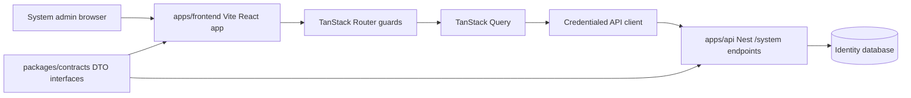

# Vite System Admin Frontend Migration Design

**Spec**: `.specs/features/vite-system-admin-frontend-migration/spec.md`
**Context**: `.specs/features/vite-system-admin-frontend-migration/context.md`
**Status**: Draft

---

## Architecture Overview

Add a parallel Vite app that talks directly to the Nest API over credentialed HTTP. Shared DTO contracts live in a new package and are consumed by both Nest DTO classes and frontend API/form code.



The current `apps/web` app remains available during this slice. `apps/frontend` is a new package and does not import Next APIs.

---

## Code Reuse Analysis

### Existing Components to Leverage

| Component | Location | How to Use |
| --- | --- | --- |
| shadcn/ui primitives | `apps/web/src/components/ui/` | Copy/adapt into `apps/frontend/src/components/ui/` and remove any Next-only imports. |
| CSS tokens | `apps/web/src/app/globals.css` | Copy token definitions into `apps/frontend/src/styles/globals.css`; preserve colors, radius, shadows, sidebar, and scoreboard tokens. |
| Utility class merge | `apps/web/src/lib/utils.ts` | Reuse `cn` implementation for shadcn components. |
| Page shell/layout patterns | `apps/web/src/components/page-shell.tsx`, `app-layout.tsx`, `app-sidebar.tsx` | Adapt dashboard layout to TanStack Router links and client auth state. |
| Date/error client helpers | `apps/web/src/lib/client-utils.ts` | Recreate Vite-safe helpers for date formatting and API envelope error messages. |
| Nest system DTOs | `apps/api/src/modules/identity/system/dtos/system-admin.dtos.ts` | Make request/response DTO classes implement shared contracts. |
| Nest auth DTOs | `apps/api/src/modules/identity/auth/dtos/auth-response.dtos.ts` | Make system auth response DTO classes implement shared contracts. |

No `.specs/codebase/CONCERNS.md` exists. No `codenavi` or `mermaid-studio` skill is installed in the available skill list, so code exploration uses built-in tools and diagrams are inline Mermaid.

### Integration Points

| System | Integration Method |
| --- | --- |
| Nest system auth | Browser redirects to Google start endpoint; API client calls `me` and `logout` with credentials. |
| Nest system admin | TanStack Query query/mutation functions call `/system/admin/**` endpoints through a shared API client. |
| Workspace | Add `apps/frontend` and `packages/contracts` under existing pnpm workspace globs. |
| Turborepo | Existing `build`, `dev`, `lint`, and `test` task names should work when packages define matching scripts. |
| CORS | Ensure Nest `CORS_ORIGIN` includes the Vite dev origin, typically `http://localhost:5173`. |

---

## Components

### `@pong-ping/contracts`

- **Purpose**: Provide framework-neutral DTO interfaces for API envelopes, system auth, tenants, and memberships.
- **Location**: `packages/contracts/`
- **Interfaces**:
  - `ApiSuccessResponse<T>`, `ApiErrorResponse`, `ApiResponse<T>`
  - `IdentityPrincipalResponseContract`, `AuthSessionResponseContract`, `AuthLogoutResponseContract`
  - `CreateSystemTenantRequestContract`, `UpdateSystemTenantRequestContract`, `SystemTenantResponseContract`
  - `CreateSystemMembershipRequestContract`, `UpdateSystemMembershipRequestContract`, `SystemMembershipResponseContract`, `SystemMembershipDeactivationResponseContract`
- **Dependencies**: TypeScript only.
- **Reuses**: Shape and naming from current Nest DTOs; not the deleted `packages/api-contracts` package.

### Nest DTO Contract Implementation

- **Purpose**: Compile-time alignment between Nest DTO classes and shared interfaces.
- **Location**: `apps/api/src/modules/identity/**/dtos/`
- **Interfaces**:
  - DTO classes add `implements <ContractInterface>`.
  - Date response contracts use `ISODateString`; service/controller mapping must return serializable ISO strings where class typing requires it.
- **Dependencies**: `@pong-ping/contracts`.
- **Reuses**: Existing class-validator and Swagger decorators.

### Frontend App Shell

- **Purpose**: Own root providers, global styles, layout, navigation, and route outlet.
- **Location**: `apps/frontend/src/`
- **Interfaces**:
  - `main.tsx` renders React root with strict mode.
  - `router.tsx` creates typed TanStack Router instance.
  - Root route provides auth/query context.
- **Dependencies**: React, TanStack Router, TanStack Query, shadcn tooltip/toaster.
- **Reuses**: Current admin layout visual language.

### Frontend API Client

- **Purpose**: Centralize credentialed API calls, envelope parsing, and error conversion.
- **Location**: `apps/frontend/src/lib/api/`
- **Interfaces**:
  - `apiRequest<TData, TBody>(path, options): Promise<TData>`
  - `getSystemMe()`
  - `logoutSystemSession()`
  - tenant and membership request functions.
- **Dependencies**: Zod for envelope parsing, shared contract types for TS shapes.
- **Reuses**: Existing success/error envelope conventions from Nest.

### Auth Route Guard

- **Purpose**: Protect `/admin/**` routes based on `GET /system/auth/me`.
- **Location**: `apps/frontend/src/routes/`
- **Interfaces**:
  - Root/router context includes `queryClient`.
  - Protected admin route `beforeLoad` ensures auth query succeeds or redirects to `/login`.
- **Dependencies**: TanStack Router, TanStack Query.
- **Reuses**: Existing system auth endpoint behavior.

### System Admin Tenant Pages

- **Purpose**: List/create/update tenants and navigate to membership management.
- **Location**: `apps/frontend/src/features/system-admin/tenants/`
- **Interfaces**:
  - `useSystemTenantsQuery()`
  - `useCreateSystemTenantMutation()`
  - `useUpdateSystemTenantMutation()`
  - `TenantListPage`
  - `CreateTenantForm`, `EditTenantDialog` or inline edit controls.
- **Dependencies**: TanStack Query, TanStack Form, Zod, shadcn table/input/select/dialog/buttons.
- **Reuses**: Existing `TenantsAdmin` UI ideas, adjusted to Nest DTO fields.

### System Admin Membership Pages

- **Purpose**: List/create/update/deactivate memberships for a tenant.
- **Location**: `apps/frontend/src/features/system-admin/memberships/`
- **Interfaces**:
  - `useSystemMembershipsQuery(tenantId)`
  - `useCreateSystemMembershipMutation(tenantId)`
  - `useUpdateSystemMembershipMutation(tenantId)`
  - `useDeactivateSystemMembershipMutation(tenantId)`
  - `MembershipsPage`, `CreateMembershipForm`, `MembershipActions`
- **Dependencies**: TanStack Query, TanStack Form, Zod, shadcn table/select/dialog/buttons.
- **Reuses**: Role constants from contracts.

---

## Data Models

### API Envelope

```typescript
type ApiSuccessResponse<T> = {
  ok: true;
  data: T;
  meta: {
    requestId?: string;
    timestamp: ISODateString;
  };
};
```

### System Tenant

```typescript
interface SystemTenantResponseContract {
  id: string;
  name: string;
  slug: string;
  active: boolean;
  createdAt: ISODateString;
  updatedAt: ISODateString;
  activeMembershipCount: number;
  ownerAdminEmails: string[];
}
```

### System Membership

```typescript
type IdentityTenantRoleDto = "owner" | "admin" | "member";

interface SystemMembershipResponseContract {
  id: string;
  tenantId: string;
  userId: string;
  email: string;
  roles: IdentityTenantRoleDto[];
  active: boolean;
  createdAt: ISODateString;
  updatedAt: ISODateString;
}
```

### Frontend Form Schemas

- Tenant create: `name`, `slug`, `ownerEmail`, `ownerRole`.
- Tenant update: optional `name`, `slug`, `active`, with at least one field changed before submit.
- Membership create: `email`, non-empty `roles`.
- Membership update: optional `roles`, optional `active`, with at least one field changed before submit.

---

## Error Handling Strategy

| Error Scenario | Handling | User Impact |
| --- | --- | --- |
| Unauthorized `me` | Auth query fails and protected route redirects to `/login`. | User sees login page. |
| Forbidden system endpoint | Show error toast or route error state. | User sees access denied/error message. |
| Validation error envelope | API client extracts envelope message. | Form keeps values and shows toast/field-level message where practical. |
| Malformed success envelope | API client throws parse error. | Generic error state/toast; logged in dev console. |
| Network failure | Query/mutation error state. | Retry button or toast; no optimistic destructive update. |
| Missing API base URL | Use documented dev default or throw startup config error. | Clear local setup failure. |

---

## Tech Decisions

| Decision | Choice | Rationale |
| --- | --- | --- |
| App placement | `apps/frontend` | User chose parallel app instead of replacing Next app. |
| Contracts package | `@pong-ping/contracts` | User chose new package; avoids touching deleted `api-contracts`. |
| Contract contents | TypeScript interfaces/types only | Keeps package framework-neutral and safe for frontend. |
| Runtime response validation | Zod at API client boundary | Catches drift between API envelope and frontend assumptions. |
| Router pattern | TanStack Router Vite plugin + generated route tree | Matches current docs and requested stack. |
| Auth state | TanStack Query `me` query | Avoids duplicate auth state and integrates route guards. |
| Forms | TanStack Form + Zod validators | Matches requested stack and keeps request DTO validation close to submit payloads. |
| Styling | Copy current shadcn tokens/components into Vite app | Preserves existing visual design without importing from Next app internals. |

